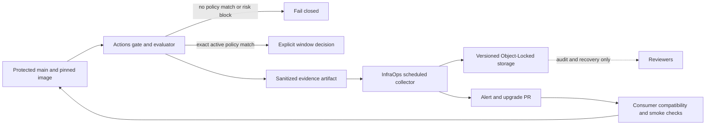

# Spec: Governed security remediation windows

## Status and decision

This document is the design proposal for issue #101. It is intentionally
reviewable before implementation: it defines the contract and ownership
between `optimizr-actions`, `optimizr-infra-ops` and consumers, but it does not
change the current deploy decision or create cloud resources.

We recommend the hybrid model:

- the consumer repository's reviewed policy on protected `main` is the only
  synchronous authority that can authorize a bounded remediation window;
- `optimizr-actions` owns portable schemas, fingerprinting, evaluation,
  sanitized outputs, evidence and compatibility tests;
- `optimizr-infra-ops` owns scheduling, S3-compatible storage, IAM, retention,
  backups, alerts and VPS/runner operations;
- consumers own image pins, compatibility and smoke tests, policy approval and
  rollback decisions;
- object storage and issue/PR automation observe and propose state
  asynchronously. They never become a network dependency that can turn a
  blocked deploy into an allowed deploy.

The current gate remains fail-closed until a later implementation is reviewed
and explicitly adopted by a consumer. Existing exception, baseline,
`security_ignore_unfixed`, retry and final-rescan behavior remains unchanged in
this design phase.

## Observed facts and assumptions

### Observed in `optimizr-actions`

- The image gate blocks unexcepted actionable findings and performs one bounded
  pull/rebuild/rescan attempt.
- `security_ignore_unfixed` is narrow and cannot authorize ordinary fixable
  vulnerabilities, secrets, misconfigurations or operational scan failures.
- Exceptions and image baselines are reviewed, exact, scoped, owned and
  expiring. Lineage-scoped image exceptions require exact package scopes.
- Evidence is sanitized and tied to repository SHA and immutable image
  identity/lineage.
- No persistent `first_seen`, deadline or remediation-SLA mechanism exists in
  the inspected security workflows, actions, scripts, schemas, tests or
  documentation.

### Assumptions for this proposal

1. A consumer can protect the proposed policy path with CODEOWNERS and branch
   protection.
2. InfraOps can provide an S3-compatible/MinIO bucket with versioning,
   retention, restricted IAM, backup and alerting without exposing credentials
   to reusable Actions.
3. A later Actions implementation can be additive and default to no window;
   no current `@v1` consumer receives a new allow path implicitly.
4. `optimizr-monitoring` is the first controlled adoption. Its issue #55
   remains responsible for image inventory and compatibility work and is not a
   special case in the reusable contract.

If any assumption is false, we revise the contract before implementation.

## Objective

We want to prevent an eligible, known image vulnerability from stopping every
delivery indefinitely while preserving a hard security boundary for findings
that cannot safely tolerate delay. The system must make the remediation work
automatic and observable, while requiring an explicit, reviewable decision for
any bounded window.

Success means that a team can:

1. detect an exact finding in an immutable image or lineage;
2. try the newest compatible official image automatically through a reviewed
   digest-pinned PR;
3. run Trivy, compatibility and smoke checks before adoption;
4. record a durable first observation, owner and deadline without relying on a
   mutable tag, local image ID or feature branch;
5. use a narrowly scoped window only when policy allows it;
6. receive an upgrade/derived-image alert before the deadline;
7. fail closed for an overdue, reintroduced, malformed, unknown or unavailable
   state; and
8. roll back to the last known-good immutable image when a compatible update
   fails post-deploy verification.

## Scope

### In scope

- Image/package vulnerability findings and their stable identity.
- A source-controlled consumer policy for explicit remediation windows.
- Additive Actions outputs and an evaluator contract.
- Sanitized append-only observation events for InfraOps storage.
- Scheduled image-update and deadline-alert workflows owned by InfraOps.
- Consumer adoption using official images first and minimal derived images only
  when justified.
- Migration, rollback, hosted/self-hosted parity and `v1` compatibility.

### Out of scope

- Creating a bucket, IAM identity, cron, backup or VPS change in this
  repository.
- Calling private storage or GitHub APIs synchronously from the security gate.
- Broadening `security_ignore_unfixed` or adding a generic warning mode.
- Automatically accepting exceptions, editing consumer policy on `main`, or
  merging a dependency/image update without protected checks.
- Treating scanner, database, evidence, secrets or misconfiguration failures
  as remediation windows.
- Applying this contract to dependency or SAST findings in the first rollout.
  Those gates retain their own exact, reviewed, expiring policy until a
  separate design extends them.

## Policy invariants

These are non-negotiable acceptance conditions for a future implementation:

1. A window is not a `clean` result. It is a separately visible,
   explicitly-enabled decision with its own evidence and manifest state.
2. The default decision remains blocking. A consumer must opt in to the future
   window path, and the policy must match the exact finding and immutable image
   lineage.
3. Secrets, misconfigurations, scanner/database/evidence failures, known
   exploitation, internet-facing critical exposure and privilege-boundary
   findings block immediately.
4. A fixed version that is already available and compatible is not eligible for
   tolerance. The first action is to update and verify it. A window may only
   cover a reviewed upstream-release gap or a documented compatibility barrier
   while the derived-image/upgrade work is active.
5. A missing, malformed, expired, overdue, reintroduced or unavailable state
   never grants a window.
6. `first_seen` is immutable for a finding identity. A feature branch, force
   push, image retag, local rebuild or deletion of an unmerged policy file
   cannot restart the clock.
7. An extension preserves the original `first_seen` and original deadline in
   the audit trail. It is a new reviewed policy revision, not an in-place reset.
8. A window only applies to deploys containing the affected exact image or
   lineage. Consumers may choose a stricter service-wide or repository-wide
   block.
9. Every allowed decision emits sanitized evidence with source SHA, policy
   digest, finding fingerprint, immutable image identity/lineage, state,
   deadline and evaluator version.
10. Storage, scheduler and alerting failures reduce capability to blocking;
    they never increase capability to deploy.

## Architecture and ownership

| Boundary | Owns | Must not own |
| --- | --- | --- |
| `optimizr-actions` | Policy schema, exact fingerprinting, eligibility evaluator, additive outputs, evidence schema, contract/static tests, reusable interfaces | Private VPS paths, storage credentials, production inventory, mutable-tag updates |
| `optimizr-infra-ops` | Cron/scheduler, S3-compatible storage, Object Lock/versioning, IAM, retention, off-host backup, restore checks, alerts, runner/VPS operations | A second policy evaluator or silent policy approvals |
| Consumer repository | Pinned images, compatibility/smoke tests, CODEOWNERS, policy PR approval, service criticality/exposure declaration, rollback pin | Disabling the central gate or using wildcard/grace flags |
| Monitoring first adoption | Image inventory and compatible official-image review in #55; later controlled contract adoption | Special-case behavior in the reusable or broad `ignore_unfixed` |

The reusable action is portable and can run on GitHub-hosted or trusted
self-hosted runners. It receives repository-local policy and scan evidence; it
does not fetch a ledger during the decision.



## Stable finding identity

The evaluator must use a canonical fingerprint rather than a mutable tag or
local Docker image ID. The identity is the tuple below, normalized and hashed
from canonical JSON:

```json
{
  "service": "monitoring",
  "advisory_id": "CVE-YYYY-NNNN",
  "package_purl": "pkg:deb/debian/openssl@1.2.3",
  "installed_version": "1.2.3",
  "fixed_version": "1.2.4",
  "image_lineage_digests": ["sha256:<full-parent-or-published-digest>"]
}
```

The canonical identity must require:

- an advisory identifier and exact package PURL;
- installed and fixed versions when Trivy provides them;
- the exact immutable image digest or exact lineage digest set;
- a stable consumer/service scope;
- sorted, duplicate-free digest arrays and deterministic serialization.

Changing the package, installed/fixed version, image lineage or service scope
creates a new finding. A new local image ID with the same reviewed lineage and
package fingerprint does not create a new clock. Mutable tags, partial
digests, wildcard lineage and an ID without lineage are never valid window
identity.

## Proposed source-controlled policy contract

The first implementation should consume a repository-relative file such as
`.github/security/remediation-windows.json`. The name is proposed and is not
yet a public `v1` input. The file is reviewed on protected `main`, owned in
CODEOWNERS and validated as fail-closed JSON.

```json
{
  "version": 1,
  "policy_owner": "team-monitoring",
  "entries": [
    {
      "id": "rw-monitoring-cve-yyyy-nnnn-openssl",
      "fingerprint": {
        "service": "monitoring",
        "advisory_id": "CVE-YYYY-NNNN",
        "package_purl": "pkg:deb/debian/openssl@1.2.3",
        "installed_version": "1.2.3",
        "fixed_version": "1.2.4",
        "image_lineage_digests": ["sha256:<full-digest>"]
      },
      "reason": "upstream_fixed_image_not_released",
      "first_seen_at": "2026-07-30T12:00:00Z",
      "deadline_at": "2026-08-06T12:00:00Z",
      "owner": "team-monitoring",
      "statement": "Newest compatible official image remains affected while upstream release is pending.",
      "compensating_control": "Restricted ingress and daily image-update verification.",
      "reviewed_at": "2026-07-30T15:00:00Z",
      "reviewed_by": "security-owner",
      "status": "active"
    }
  ]
}
```

The final field names must be agreed before code. The contract must enforce:

- RFC3339 UTC timestamps and `deadline_at > first_seen_at`;
- an owner, reviewer, reason, statement and compensating control;
- a maximum window derived from severity, exposure and service criticality;
- no duplicate IDs or fingerprints;
- no wildcard scope and no mutable image tag;
- no future `first_seen_at` and no deadline extension without an explicit
  revision record;
- `status=active` only for an eligible finding;
- policy digest and source commit included in evidence.

The policy file is the approval record. A scheduled bot may propose an entry
or an update in a pull request, but it must not commit directly to protected
`main` or silently create a window.

## Time and state policy

### Clock start

The clock starts at the first valid observation of the exact fingerprint on a
protected `main` or production-candidate scan, whichever the organization
selects as its deployment authority. Findings seen only on feature branches do
not start a production remediation clock. The observation stores source SHA,
immutable image identity/lineage, scanner/database metadata and evidence hash.

The advisory publication date and branch history may be recorded as context,
but they do not replace the first valid deployment-authority observation. This
avoids branch deletion, rebasing and force-push behavior resetting the window.

### Recommended risk limits

We recommend a reviewed risk matrix rather than one generic grace period:

| Condition | Window |
| --- | --- |
| Known exploitation, internet-facing critical, secret, misconfiguration, scanner/database/evidence failure, or privileged-boundary critical | None; block immediately |
| Critical without the immediate-block conditions | At most 7 calendar days, with explicit security-owner approval |
| High without the immediate-block conditions | At most 30 calendar days, with service-owner approval |
| Lower severity or non-image finding | Not covered by this first contract |

These are maximums, not automatic grants. The consumer policy may choose a
shorter deadline. EPSS/KEV-like signals can inform review, but no external
score is allowed to silently extend a deadline or turn a block into an allow.

### State machine

```text
observed -> pending_review -> active -> due_soon -> overdue
     \-> blocked
active -> resolved
resolved -> reintroduced
active -> extended (new reviewed revision, original first_seen retained)
any invalid or unavailable state -> blocked
```

- `pending_review`: observed and proposed, not deploy-authorized.
- `active`: exact policy match, before deadline, eligibility and controls
  valid.
- `due_soon`: active but inside the alert threshold; it does not become clean.
- `overdue`: deadline reached; the affected image is blocked.
- `resolved`: the exact finding is absent from a valid rescan of the adopted
  immutable image.
- `reintroduced`: the fingerprint returns after resolution; it starts a new
  event but is not eligible for an automatic grace reset.
- `blocked`: any immediate-block class, invalid policy, missing evidence or
  unavailable authority.

An extension is represented by a new reviewed policy revision or event. It
retains the original `first_seen_at`, original deadline and reason for change;
it cannot be generated by the scheduler merely because an update PR failed.

## Actions interface and enforcement semantics

The future Actions change should be additive:

- preserve `result=passed|failed` and all current inputs/outputs;
- preserve `classification=clean|actionable_vulnerability|unfixed_warning|gate_error`;
- add a distinct `remediation_state` output;
- add `remediation_window_allowed`, defaulting to `false`;
- add sanitized reason and deadline fields only when policy/evidence validates;
- keep `security_ignore_unfixed` separate and unchanged.

The evaluator should return a discriminated decision internally:

```text
blocked(reason, classification)
allowed_window(fingerprint, deadline, policy_digest, evidence_digest)
not_applicable
```

An active window never rewrites an actionable finding as `clean`. A future
deploy reusable may continue only when all of the following are explicit:

1. the consumer opted into the window mode;
2. the exact policy entry matches the image/finding;
3. the finding is eligible and before its deadline;
4. all other filesystem and image findings pass;
5. the required compensating-control declaration is valid; and
6. the final manifest records `remediation_state=active` and the exact
   fingerprint.

If any condition is false, `docker compose up` remains unreachable. The
existing retry still runs first; `rebuild=no_change` is evidence for review,
not permission to bypass the gate.

## Observation and storage contract for InfraOps

The Actions workflow produces sanitized artifacts. A separate trusted
InfraOps workflow may ingest them into a versioned, Object-Locked S3-compatible
store. The gate must not make a synchronous read to that store.

Each event should contain only:

- schema version and deterministic event/idempotency key;
- repository alias, protected source SHA and workflow/run reference;
- exact finding fingerprint and immutable image digest/lineage;
- observed time, state, first-seen and deadline values;
- policy, evaluator, Trivy and database identifiers/hashes;
- evidence artifact hash and transition (`observed`, `approved`, `extended`,
  `resolved`, `overdue` or `reintroduced`).

It must not contain credentials, host addresses, private paths, environment
values, customer data, raw secrets, signed URLs or unbounded Trivy output.

InfraOps acceptance criteria are:

- bucket versioning and Object Lock/retention are enabled before ingestion;
- the writer identity can create objects but cannot delete or overwrite prior
  evidence versions;
- read and alert identities are separate from deploy identities;
- TLS, encryption at rest, lifecycle retention and off-host backup are
  configured and restore-tested;
- duplicate event submission is idempotent and replay is detectable;
- object-store outage generates an alert and results in no new window;
- retention expiry is documented and never removes the source-controlled
  policy approval or current deploy evidence.

The exact bucket, identities, retention period, backup target and cron belong
in `optimizr-infra-ops`; they must not be duplicated in this public repository.

## Automatic image-update lifecycle

The scheduled workflow should run outside the deploy gate and perform this
sequence:

1. discover the newest official image digest allowed by the consumer policy;
2. open or update a consumer PR that changes only the reviewed digest/policy
   candidate;
3. run compatibility tests, Trivy with the current database and service smoke
   checks;
4. optionally run a protected canary for the consumer;
5. merge only through normal review and branch protection;
6. verify health after deploy; and
7. roll back to the last successful immutable digest when post-deploy checks
   fail.

If the newest official image remains affected, the workflow reports the exact
fingerprint and keeps the remediation work open. A minimal derived image is a
separate, reviewed consumer change with a reproducible Dockerfile, provenance,
scan evidence and an explicit return-to-official-image condition. Mutable tags
are never promoted directly.

Recommended cadence is separate by purpose: a daily deadline/health check and
a weekly official-image update check. InfraOps may schedule both differently,
but a missed schedule must not create an allow decision.

## Threat model and failure handling

| Threat or failure | Required behavior |
| --- | --- |
| Delete policy entry or force-push a feature branch | No new allow; protected-main policy and immutable evidence remain authoritative; audit reports policy removal |
| Retag image or create a new local image ID | Fingerprint mismatch or lineage match only; tags/local IDs never reset the clock |
| Replay an old artifact | Validate source SHA, policy digest, event key and freshness; reject or mark duplicate |
| Race between two scheduled runs | Conditional/idempotent PR/event creation; neither run mutates policy directly |
| GitHub/API outage | No automatic policy approval or merge; existing gate remains blocking; alert for delayed remediation |
| Object storage outage | `remediation_window_allowed=false`; preserve local evidence and alert |
| Scanner/database/evidence failure | Immediate block; never classify as a window |
| Compromised consumer PR | Do not expose production secrets; run untrusted PR validation only on safe hosted runners; require protected review before merge |
| Overdue or reintroduced finding | Block affected immutable image; open/update work item; require new review for any new entry |
| Failed post-deploy health check | Restore last successful immutable digest and retain evidence |

The main residual risk is a privileged maintainer deleting an approved policy
entry on protected `main`. CODEOWNERS, branch protection and immutable audit
events reduce this risk; deletion must make the next scan block rather than
recreate a window.

## Alternatives considered

| Approach | Benefit | Cost/risk | Decision |
| --- | --- | --- | --- |
| Extend existing exceptions/baselines | Smallest enforcement change | Semantics become overloaded; aging and upgrade automation remain implicit | Retain for current emergency containment, do not add window state there |
| External persistent ledger as gate authority | Strong cross-run aging | New mutable trust boundary, outage and race can affect deploy decisions | Reject as synchronous authority |
| GitHub issue as gate authority | Human-visible workflow | API permissions, parsing, deletion and availability are poor gate dependencies | Use only for proposal/alert context |
| Hybrid source-controlled policy plus async storage/audit | Reviewed authority, durable observation and clear outage behavior | Requires coordination between three repositories | Recommend |

## Testing strategy

### `optimizr-actions`

Before implementation, add failing contract tests for:

- canonical fingerprint stability across local image IDs and rebuilds;
- rejection of mutable tags, partial digests, wildcards and missing PURLs;
- eligibility and immediate-block matrix;
- immutable first-seen and non-resetting extensions;
- deadline transitions, overdue behavior and reintroduction;
- malformed/missing policy and unavailable storage behavior;
- hosted and trusted self-hosted output parity;
- additive outputs, default `remediation_window_allowed=false` and unchanged
  `result`/`classification` semantics;
- sanitized evidence with no credentials, paths, hosts, raw secrets or
  unbounded report content;
- all third-party Actions references remaining full-SHA pinned.

The implementation must use `python -m unittest discover -v`, Python
compilation, YAML/actionlint validation, secret scanning and `git diff --check`.
The exact PR SHA and hosted checks are authoritative before any `v1` movement.

### `optimizr-infra-ops`

The separate implementation must test bucket versioning/Object Lock, IAM
least privilege and delete denial, conditional/idempotent writes, backup and
restore, alerting, scheduler failure, and sanitized event ingestion. It must
not duplicate the Actions evaluator.

### `optimizr-monitoring`

The first controlled consumer must test every current runtime image through the
official-image-first sequence, record the failed run artifact, pass
compatibility/smoke checks, and prove rollback to the previous digest. It must
not add `security_require_image_scan:false`, broaden `ignore_unfixed` or add a
wildcard exception as part of adoption.

## Project structure and implementation slices

The design deliberately separates work into reviewable slices:

1. **Actions contract:** add the policy schema, evaluator and additive outputs
   with default blocking behavior; add unit/static tests and documentation.
2. **InfraOps integration:** add the scheduled collector, Object-Locked event
   store, backup/restore and alerts; consume sanitized artifacts only.
3. **Consumer adoption:** add the Monitoring policy path, digest-pinned update
   PR and compatibility/smoke/rollback evidence.
4. **Organization rollout:** audit adoption and migrate additional consumers
   only after the first controlled run is green.

No slice moves `v1`, merges a consumer PR, changes production, creates storage
or grants IAM without explicit human approval.

## Commands and verification checkpoints

### Design PR

```text
python -m unittest discover -v
python -m compileall -q scripts tests
git diff --check
```

The design-only PR should also verify that no workflow, action, script or
consumer policy changed behavior. It is safe to review and merge independently
of InfraOps provisioning, but it is not a release of the new contract.

### Actions contract PR

```text
python -m unittest tests.test_security_gate_remediation_window -v
python -m unittest tests.test_security_gate_contract -v
python -m compileall -q scripts tests
git diff --check
```

Add actionlint/YAML and hosted-run validation before publication. Keep the
existing full suite requirement from `AGENTS.md`.

### InfraOps and consumer checkpoints

Do not call the system adopted until the InfraOps restore/IAM checks and
Monitoring digest/compatibility/rollback checks have produced sanitized
evidence linked to the exact commits and image digests.

## Boundaries

- **Always:** keep the current fail-closed gate, use exact immutable scope,
  preserve original `first_seen`, emit sanitized evidence, pin third-party
  actions, and test both runner paths.
- **Ask first:** introduce a new `v1` output/input, change deploy permission or
  rollout semantics, create storage/IAM/cron, bootstrap a legacy finding,
  extend a deadline, or adopt the window in a consumer.
- **Never:** use a mutable tag or wildcard as identity, make storage a live
  allow authority, broaden `ignore_unfixed`, turn scanner errors into warnings,
  expose production secrets to untrusted code, or move `v1` without exact-SHA
  validation.

## Migration and rollback

1. Merge this design for review only; current consumers continue unchanged.
2. Implement and validate the Actions contract with all defaults blocking.
3. Implement InfraOps storage/scheduler/backup/alerts without enabling any
   consumer window.
4. Bootstrap only findings explicitly inventoried and approved in a consumer
   PR. Do not convert all existing findings into fresh windows.
5. Adopt first in Monitoring after #55 completes the official-image review and
   proves compatibility and rollback.
6. Expand by consumer with a written migration and a bounded pilot.

Rollback is additive and fail-closed: remove the consumer opt-in or policy
entry, pin the consumer to the previous Actions SHA, or move governed `v1` back
to the previously validated SHA. Disabling the scheduler or storage collector
does not disable the security gate and cannot authorize deployment.

## Success criteria

- The policy and ownership boundaries are reviewed and unambiguous.
- Immediate-block classes and eligible image/package conditions are explicit.
- The identity and clock rules cannot be reset by ordinary rebuilds, tags,
  branches or local IDs.
- Storage outage, replay, race, overdue and reintroduced findings fail closed.
- Existing exception/baseline and `@v1` consumers remain supported without
  automatic behavior changes.
- Monitoring can adopt the same generic contract without special casing.
- Actions, InfraOps and consumer acceptance tests cover the full lifecycle
  from observation through upgrade, verification and rollback.

## Open questions for review

These decisions should be closed in the issue before implementation:

1. Confirm the exact policy filename and final field names.
2. Confirm whether the organization will use 7/30-day maximums or a different
   reviewed risk matrix.
3. Confirm the authoritative deployment clock (`main` scan versus production
   candidate scan when they differ).
4. Confirm the alert threshold for `due_soon` and the first InfraOps schedule.
5. Confirm the Object Lock mode, retention and restore target in InfraOps.
6. Confirm the exact consumer input/output name for the opt-in window path.

Until these are reviewed, no remediation window is active and no current
deploy gate is changed.
